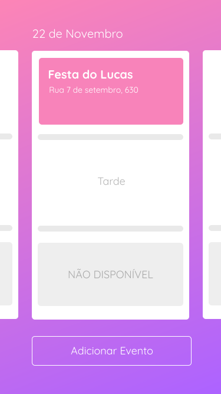

<h1 align="center">
    
    <br>
    Partiers
    <br>
    
    
    
    
</h1>

<div align="center">
    <h4 style="margin-bottom: 0;"> 🚧  Under construction.  🚧</h4>
</div>

<p align="center">Partiers is a project to help people hire party entertainers.</p>

<p align="center">
 <a href="#-goal">Goal</a> •
 <a href="#-features">Features</a> • 
 <a href="#-requirements">Requirements</a> • 
 <a href="#%EF%B8%8F-runing-project-%EF%B8%8F">Running project</a> • 
 <a href="#-technologies">Technologies</a> • 
 <a href="#%EF%B8%8F-author">Author</a>
</p>

## 🎯 Goal

<p align="center">Partiers is a project develop to help customers hiring party entertainers easily to their parties</p>

## 🎩 Features

### API
#### Client
- [x] User register
- [x] JWT authentication
- [x] List Available partiers
- [x] Create event in partiers schedule
- [x] Update event in partiers schedule
- [x] Delete event in partiers schedule
- [x] List all events

#### Partier
- [x] User register
- [x] JWT authentication
- [x] List schedule
- [x] List Available partiers
- [x] Create event
- [x] Update event
- [x] Delete event
- [x] List all events


### Web
#### Client
- [ ] User register
- [ ] JWT authentication
- [ ] List Available partiers
- [ ] Create event in partiers schedule
- [ ] Update event in partiers schedule
- [ ] Delete event in partiers schedule
- [ ] List all events

#### Partier
- [ ] User register
- [x] JWT authentication
- [x] List schedule
- [ ] List Available partiers
- [x] Create event
- [ ] Update event
- [ ] Delete event
- [ ] List all events

## 👨🏻‍🔬 Requirements

Before we begin, you'll need to have the following dependencies installed:
[Git](https://git-scm.com), [Node.js](https://nodejs.org/en/) and [Yarn](https://yarnpkg.com/).
Besides, it would be great that you have a code editor to work on this project, such as [VSCode](https://code.visualstudio.com/).

## 🏃‍♀️ Runing project 🏃‍♂️

### ⚠️ Attention ⚠️ ###

### 🕵️‍♀️ Hint 🕵️‍♂️ ###
#### You can also access the Insomnia file below to check for api features and how to use them.
<p align="center">
    <a href="assets/insomnia/insomnia-partiers.json">
        
    </a>
</p>

```bash
#### Start sever ####

# Clone the repo
$ git clone <https://github.com/thalessarubbi/partiers.git>

# Access project folder from a terminal
$ cd Partiers

# Go to api folder
$ cd api

# Install dependencies
$ yarn

# run api on dev mode
$ yarn dev:server

# The server will start at port :3333 - access <http://localhost:3333>


#### Start web app ####

# Access project folder from a terminal
$ cd Partiers

# Go to web folder
$ cd web

# Install dependencies
$ yarn

# run web ap on dev mode
$ yarn start

# The web app will start at port :3000 - access <http://localhost:3000>
```

## 🛠 Technologies

- [Node.js](https://nodejs.org/en/)
- [React](https://pt-br.reactjs.org/)
- [TypeScript](https://www.typescriptlang.org/)
- [Postgres](https://www.postgresql.org/)
- [TypeORM](https://typeorm.io/#/)
- [Axios](https://github.com/axios/axios)
- [styled-components](https://github.com/axios/axios)
- [VS Code](https://code.visualstudio.com/) with [EditorConfig](https://marketplace.visualstudio.com/items?itemName=EditorConfig.EditorConfig) and [ESLint](https://marketplace.visualstudio.com/items?itemName=dbaeumer.vscode-eslint)

## ✍️ Author
---
<br />

<br />
<sub><b>Thales Sarubbi</b></sub>


Made with 💙 by Thales Sarubbi 🗣 Let's talk!


[](https://www.linkedin.com/in/thales-sarubbi/) 
[](mailto:thalessarubbi@gmail.com)
